# Implementation Plan - Material Control System (Estimate vs Fact)

# Goal
Implement a comprehensive "Material Control System" that allows uploading project estimates (Excel), tracking material usage against these estimates, and visualizing overspending. This transforms the system from simple tracking to active cost control.

## User Review Required
> [!IMPORTANT]
> **Non-blocking Validation**: The system will allow creating requests even if they exceed the estimate (to prevent work stoppage), but will display a prominent **Red Warning** to the Foreman and Manager.
> **Items Outside Estimate**: A specific flow will be added for "Unplanned Items" to distinguish them from estimated materials.

## System Architecture (Data Flow)

```mermaid
graph TD
    Manager[👤 Manager] -->|1. Upload Excel| System[⚙️ Backend]
    EstimateFile[📄 Estimate.xlsx] -.-> Manager
    
    System -->|2. Parse & Store| Limits[📊 DB: Estimate Items]
    
    Foreman[👷 Foreman] -->|3. Create Request| Validation{Check Limit}
    Limits -.-> Validation
    
    Validation -->|Under Limit| Green[✅ Request Created]
    Validation -->|OVER LIMIT!| Red[⚠️ Warning + Record]
    
    Red -->|Notify| ManagerApp[📱 Manager Dashboard]
    Green -->|Update Fact| ManagerApp
    
    style Red fill:#ffcccc,stroke:#ff0000
    style Green fill:#ccffcc,stroke:#00ff00
```

## Proposed Changes

### 1. Database & Backend
**File:** `backend/app/models.py`
- [NEW] Model `EstimateItem`
    - `cost_object_id` (FK)
    - `name` (String)
    - `unit` (String)
    - `quantity_plan` (Float)
    - `price_plan` (Float)
    - `category` (String) - extracted from Excel headers (e.g., "KL-10kV").

**File:** `backend/app/analytics/services/estimate_service.py`
- [NEW] `import_estimate_from_excel(file)`: Logic to parse the specific estimate format (headers, categories, items).
- [NEW] `get_estimate_progress(object_id)`: Aggregates `MaterialRequests` vs `EstimateItems`.

**File:** `frontend/src/miniapp/pages/MaterialRequestForm.tsx`
- **Modify Item Selection**: Replace text input with **Searchable Dropdown**.
- **Visual Feedback**:
    - Display "Available vs Limit".
    - Show **Red Alert** if `requested > available`.

### 3. Manager Mini App (Visualization)
**File:** `frontend/src/miniapp-manager/pages/ManagerEstimatePage.tsx`
- **New Tab/Page**: "Смета" (Estimate).
- **Features**:
    - Table with Progress Bars (Green/Red).
    - **Filter**: "Show Overspending" to quickly find problems.

## Verification Plan

### Automated Tests
- Test parsing of sample Excel estimate file.
- Verify status calculation (OK vs Overspend).

### Manual Verification
1.  **Import**: Upload the sample `.xlsx` estimate.
2.  **Foreman Flow**: Try to order an item *exceeding* the limit and verify the Red Warning appears.
3.  **Manager Flow**: Verify the item shows up in the "Estimate vs Fact" table with the correct progress bar color.
