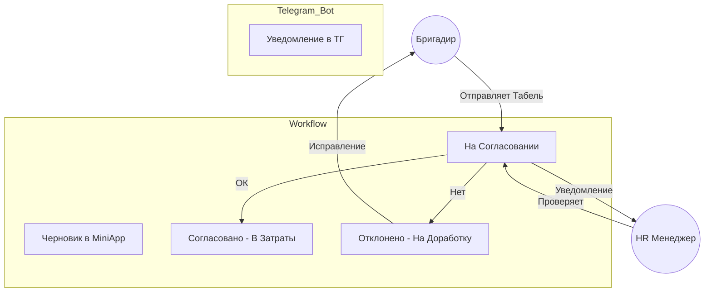
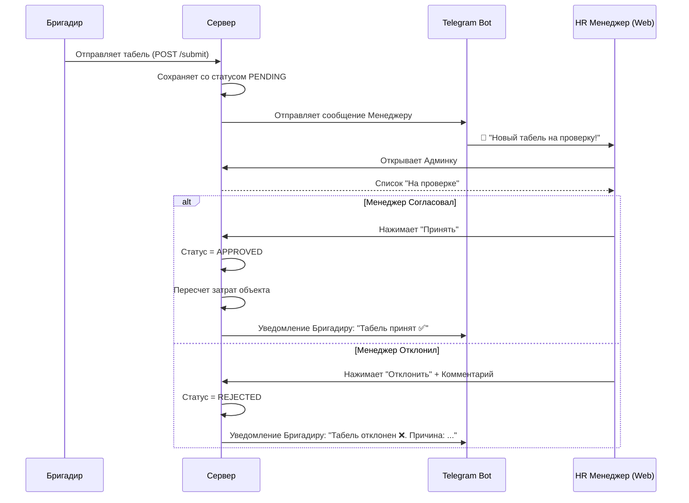

# План интеграции Telegram Mini App (С Учетом Согласования)

Этот документ описывает полную архитектуру и пошаговый план внедрения Табеля (Mini App) с учетом бизнес-процесса согласования HR-менеджером.

## 1. Архитектура решения




### Основные компоненты:
1.  **Frontend (Mini App)**: Размещается на **GitHub Pages**.
2.  **Backend (API)**: FastAPI.
3.  **Telegram Bot**: Уведомляет менеджера о новых табелях.
4.  **Admin Panel**: Веб-интерфейс менеджера для согласования.

---

## 2. Бизнес-логика согласования

1.  **Подача**: Бригадир заполняет и отправляет табель.
2.  **Статус "На проверке"**: Запись появляется в базе со статусом `PENDING`. **В затраты объекта деньги еще НЕ списываются.**
3.  **Уведомление**: Бот отправляет сообщение HR-менеджеру:
    > "Новый табель! Объект: Зеленый Парк. Дата: 03.02. Работников: 5. [Посмотреть]"
4.  **Решение Менеджера**:
    *   ✅ **Согласовать**: Статус меняется на `APPROVED`. Часы считаются в затраты объекта (ЗП). Бригадир видит зеленую галочку.
    *   ❌ **Отклонить**: Менеджер пишет причину (напр. "Иванов не работал"). Статус меняется на `REJECTED`.
5.  **Исправление**: Бригадир видит красный статус и комментарий. Он меняет часы и отправляет заново (статус снова `PENDING`).

---

## 3. Схема Базы Данных (Обновленная)

Добавляем поля для статусов и причин отказа.

```sql
-- Статусы: 'PENDING', 'APPROVED', 'REJECTED'

CREATE TABLE IF NOT EXISTS timesheet_batches (
    id SERIAL PRIMARY KEY,
    date DATE NOT NULL,
    object_id INTEGER REFERENCES objects(id),
    foreman_telegram_id BIGINT NOT NULL,
    status TEXT DEFAULT 'PENDING', -- Статус всей пачки
    rejection_reason TEXT, -- Комментарий менеджера если отказано
    created_at TIMESTAMP DEFAULT NOW(),
    updated_at TIMESTAMP DEFAULT NOW()
);

CREATE TABLE IF NOT EXISTS timesheet_entries (
    id SERIAL PRIMARY KEY,
    batch_id INTEGER REFERENCES timesheet_batches(id),
    worker_name TEXT NOT NULL,
    hours INTEGER NOT NULL,
    is_overtime BOOLEAN DEFAULT FALSE,
    rate_applied DECIMAL(10, 2)
);
```

---

## 4. Визуализация Рабочего Процесса (User Flow)



## 5. План реализации

### Этап 1: База данных и API
*   [ ] Обновить таблицы БД (добавить `status`, `rejection_reason`, группировку по `batch_id`).
*   [ ] Реализовать логику: Затраты считаются ТОЛЬКО если `status == 'APPROVED'`.

### Этап 2: Уведомления (Telegram)
*   [ ] Добавить `ADMIN_CHAT_ID` в настройки (кому слать уведомления).
*   [ ] При поступлении табеля -> Бот пишет в `ADMIN_CHAT_ID`.

### Этап 3: Интерфейс Менеджера (Существующий Web)
*   [ ] Страница "Входящие табели".
*   [ ] Кнопки "Принять" и "Отклонить".
*   [ ] Поле ввода причины отказа.

### Этап 4: Доработка Mini App
*   [ ] Отображать статус отправленного табеля (Часики / Галочка / Крестик).
*   [ ] Если "Отказ" -> Разрешить редактирование и повторную отправку.

## 6. Спецификация API (Чтобы убрать все муляжи)

Чтобы в приложении **не осталось ни одной строчки фиктивных данных**, сервер должен реализовать следующие методы. Mini App будет вызывать их при старте.

| Данные в Mini App | Сейчас (Муляж) | Будет (API Запрос) | Описание |
| :--- | :--- | :--- | :--- |
| **Список Объектов** | Hardcoded array `objects` | `GET /api/objects` | Возвращает активные объекты (id, name). |
| **История Табелей** | `MOCK_HISTORY` | `GET /api/timesheets/history` | Возвращает список за 30 дней со статусами. |
| **Состав Бригады** | LocalStorage (частично) | `GET /api/brigade/template` | Загружает любимых рабочих бригадира. |
| **ФИО Прораба** | `WebApp.initData` | `GET /api/auth/me` | Проверка авторизации и получение реального ФИО из БД (надежнее). |

### Контракты API (JSON)

**1. Получение объектов (`GET /api/objects`)**
```json
[
  { "id": 1, "name": "ЖК Зеленый Парк" },
  { "id": 5, "name": "Офис (Ремонт)" }
]
```

**2. Получение истории (`GET /api/timesheets/history`)**
```json
[
  {
    "id": 105,
    "date": "2024-02-03",
    "object_name": "ЖК Зеленый Парк",
    "status": "PENDING", // PENDING, APPROVED, REJECTED
    "workers_count": 5,
    "total_hours": 40,
    "rejection_reason": null
  }
]
```

**3. Отправка табеля (`POST /api/timesheet/submit`)**
```json
{
  "date": "2024-02-03",
  "object_id": 1,
  "entries": [
    { "worker_name": "Иванов И.И.", "hours": 8 },
    { "worker_name": "Петров П.П.", "hours": 10, "is_overtime": true }
  ]
}
```

---

## 7. Следующие шаги (Roadmap)

Мы полностью завершили прототипирование. Теперь переходим к **Prod-разработке**.

1.  **Frontend**: Заливаем код на GitHub Pages (чтобы получить реальную ссылку).
2.  **Backend**:
    *   Создаем таблицы в БД (скрипт выше).
    *   Пишем 3 API метода (Objects, History, Submit).
3.  **Связка**:
    *   В `TimeSheetFlow.tsx` заменяем массив `objects` на вызов `fetch('/api/objects')`.
    *   В `HistoryPage.tsx` заменяем `MOCK_HISTORY` на вызов `fetch('/api/timesheets/history')`.

**Итог:** Приложение станет полностью динамическим. Любое изменение в базе (добавили объект, приняли отчет) моментально отразится у всех бригадиров.
