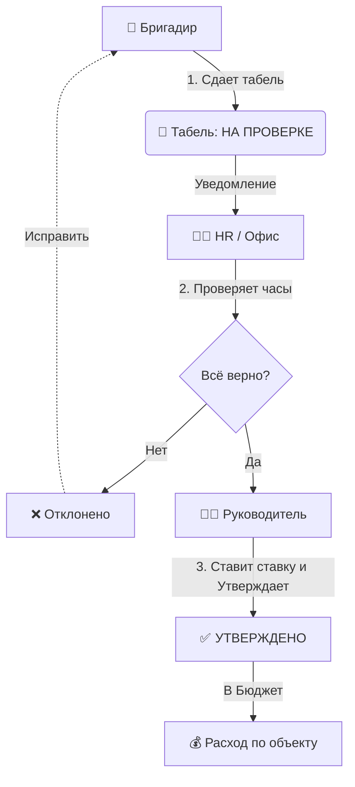
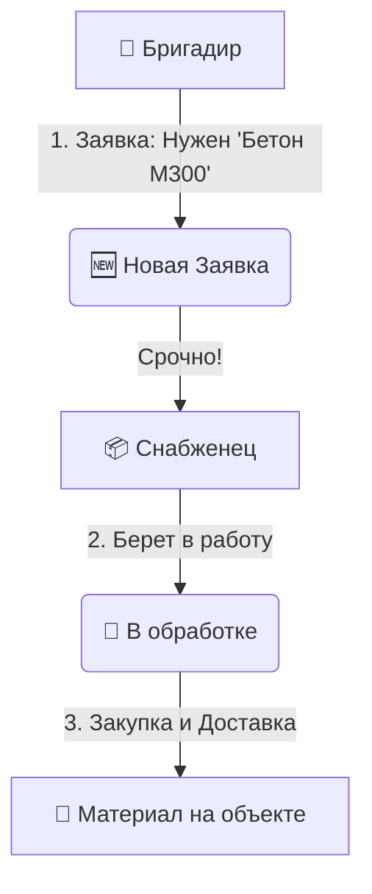
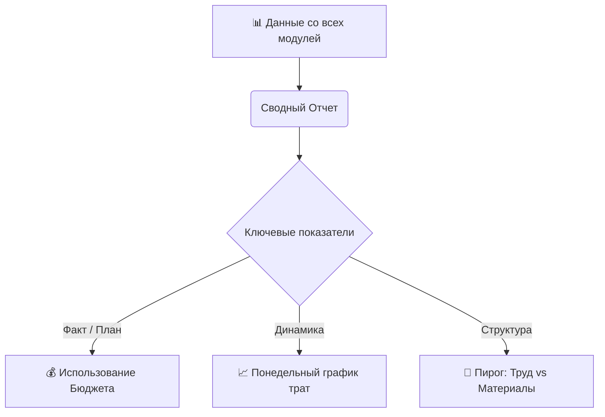

# Описание Бизнес-Процессов Системы Учета

Этот документ описывает полную логику работы системы управления строительством, разделенную на ключевые модули. Всё изложено простым языком для понимания бизнес-пользователями.

---

## 1. Модуль: Учет Рабочего Времени (РТБ)
*Контроль трудозатрат бригад и расчет ФОТ.*

### Схема процесса


### Как это работает
1.  **Сбор**: Бригадир через Telegram-бота отправляет отчет за период (кто, где, сколько часов). Можно фото Excel или кнопками.
2.  **Проверка**: HR видит табель. Если есть переработки (>12ч) или ошибки, табель возвращается бригадиру на доработку.
3.  **Финансы**: Руководитель утверждает табель и задает стоимость часа. Только в этот момент система начисляет зарплату и списывает деньги из бюджета объекта.

---

## 2. Модуль: Снабжение (Материалы)
*Заказ материалов на объект, чтобы стройка не стояла.*

### Схема процесса


### Как это работает
1.  **Заявка**: Бригадир со стройки пишет в боте/системе: "На объект 'Дом Ленина' нужно 10 кубов бетона к пятнице". Указывает срочность (Обычная / Срочная / Критическая).
2.  **Реакция**: Снабженцы получают уведомление. Менеджер нажимает "Взять в работу", чтобы бригадир видел — заявку приняли.
3.  **Результат**: Материал закупается и едет на объект. (Сами деньги учитываются отдельно через УПД, см. раздел 5).

---

## 3. Модуль: Аренда Техники
*Заказ и оплата работы спецтехники (краны, экскаваторы).*

### Схема процесса
```mermaid
graph TD
    A[👷 Бригадир] -->|1. Заказ: Нужен Кран на 3 дня| B(🆕 Заявка на технику)
    B --> C[👨‍💼 Руководитель]
    C -->|2. Находит поставщика и Цену| D[✅ Утверждена + Ставка]
    
    D --> E[🚜 Техника работает]
    E -->|3. Бригадир вносит часы| F[⏱ Учет времени]
    F -->|В Бюджет| G[💰 Списание денег (Часы * Ставка)]
```

### Как это работает
1.  **Заказ**: Бригадир заказывает технику на определенные даты.
2.  **Согласование**: Руководитель находит подрядчика и утверждает заявку, указывая цену часа (например, 2500 руб/час).
3.  **Факт работы**: Каждый день бригадир или механизатор вносит реально отработанные часы.
4.  **Списание**: Система автоматически считает стоимость (`Часы * Ставка`) и добавляет её в расходы объекта.

---

## 4. Модуль: Финансы и Документы (УПД)
*Фактический учет стоимости материалов через официальные документы.*

### Схема процесса
```mermaid
graph TD
    A[📄 Бухгалтер / ЭДО] -->|1. Загрузка файла XML| B[🤖 Система (Парсер)]
    B -->|2. Чтение данных| C(Список товаров и цен)
    C -->|3. Привязка| D[🏗 Объект строительства]
    D -->|В Бюджет| E[📊 Фактические затраты на материалы]
```

### Как это работает
1.  **Загрузка**: Накладные (УПД) из 1С или ЭДО загружаются в систему в виде файлов.
2.  **Магия (Парсинг)**: Система сама "читает" файл, находит там поставщика, названия товаров, цены и НДС.
3.  **Распределение**: Расходы привязываются к конкретному объекту. Так мы понимаем, что "Цемент" из накладной №123 был куплен именно для "Объекта А", а не "Объекта Б".

---

## 5. Объекты и Аналитика
*Главная цель системы — план/факт анализ.*

Все данные из модулей выше стекаются в единую карточку объекта:
*   **Бюджет (План)**: Сколько денег выделил заказчик по договору.
*   **Факт (Расходы)**:
    *   ➕ Зарплата рабочих (из Табелей)
    *   ➕ Стоимость техники (из Модуля Техники)
    *   ➕ Стоимость материалов (из УПД)
*   **Итог**: Мы видим **Маржинальность** (Прибыль) в реальном времени. Если расходы превышают бюджет, система это подсвечивает.

---

## 6. Модуль: Дополнительные Расходы
*Учет затрат, которые не попадают в основные категории.*

### Как это работает
Иногда возникают расходы, которые нельзя отнести к табелю или накладной (например, "Вывоз мусора", "Представительские расходы" или "Разовая выплата разнорабочим").
*   **Ручной ввод**: Менеджер или Бухгалтер вручную создает запись расхода.
*   **Типы**:
    *   *Ручные трудозатраты* (если бригада работала без табеля).
    *   *Прочие расходы* (любые другие траты).
*   **Итог**: Эти суммы просто добавляются в общую корзину расходов по объекту.

---

## 7. Модуль: Аналитика и Отчеты
* "Пульт управления" для руководителя.*

### Схема процесса


### Какие отчеты получает бизнес
1.  **Сводка по объектам**: Таблица, где видно состояние всех строек сразу (Бюджет, Факт, Остаток). Сразу видно, кто "вылезает" за смету.
2.  **Детальный отчет по объекту**: Полная история: сколько зарплаты выплачено, сколько бетона завезено, сколько часов кран работал.
3.  **Экспорт в Excel**: Любой отчет можно скачать, чтобы покрутить цифры самостоятельно.

---

## Роли в системе
*   **Бригадир**: "Глаза и руки" на стройке. Создает первичные данные (табели, заявки).
*   **Снабженец**: Обеспечивает стройку материалами по заявкам.
*   **Руководитель / Менеджер**: Принимает финансовые решения (утверждает ставки, цены).
*   **Бухгалтер**: Загружает документы (УПД) для подтверждения факта.
*   **Администратор**: Управляет доступом и справочниками.
